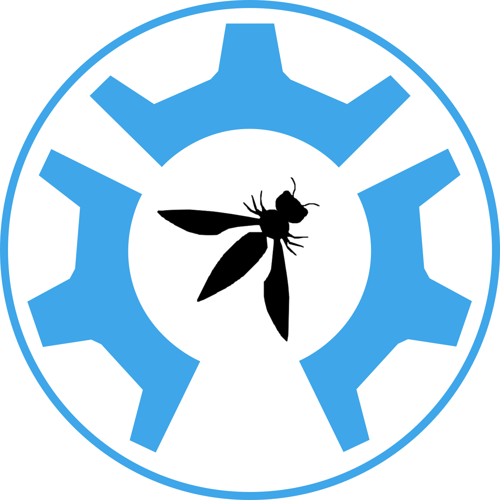

<h1 align="center">
  <br>
  <a href="https://github.com/OWASP/SecureTea-Project">
  </a>
  <br>
  OWASP SecureTea
  <br>
</h1>

<h4 align="center">One stop security solution for your device<a href="https://github.com/OWASP/SecureTea-Project" target="_blank"></a></h4>

<p align="center">
  <a href="#features">Features</a> •
  <a href="#installation">Installation</a> •
  <a href="#quick-start">Quick Start</a> •
  <a href="#project-leaders">Project Leaders</a> •
  <a href="#contributors">Contributors</a> •
  <a href="/doc/en-US/user_guide.md">User Guide</a> •
  <a href="/doc/en-US/dev_guide.md">Developer Guide</a>
</p>

[![Build Status][Travis-badge]][Travis]
[![Codacy Badge][Codacy-badge]][Codacy]
[![PyPI][PyPi-badge]][PyPi]
[![GitHub][License-badge]][License]
[![Telegram][Telegram-badge]][Telegram]
[![Version][Version-badge]][Version]
[![Tag][Tag-badge]][Tag]
[![GitHub issues][Issues-badge]][Issues]
[![GitHub pull requests][PR-badge]][PRs]
[![GSOC 2019][GSOC-2019-badge]][GSOC-OWASP]
[](https://twitter.com/secureteatool)
[](#contributors)
[![Heroku][Heroku]](https://secure-tea.herokuapp.com/)

**The OWASP SecureTea Project** provides a one-stop security solution for various devices (personal computers / servers / IoT devices).

![Dashboard][Dashboard]

## Features

- [x] [Intrusion Detection System](/doc/en-US/user_guide.md#intrusion-detection-system)
- [x] [Firewall](/doc/en-US/user_guide.md#firewall)
- [x] [Web Application Firewall](/doc/en-US/user_guide.md#web-application-firewall)
- [x] [AntiVirus](/doc/en-US/user_guide.md#antivirus)
- [x] [Malware Analysis](/doc/en-US/user_guide.md#setting-up-malware-analysis)
- [x] [Server Log Monitor](/doc/en-US/user_guide.md#server-log-monitor)
- [x] [System Log Monitor](/doc/en-US/user_guide.md#system-log-monitor)
- [x] [Local Web Deface Detection & Prevention System](/doc/en-US/user_guide.md#web-deface-detection)
- [x] [Auto Web Server Patcher](/doc/en-US/user_guide.md#auto-server-patcher)
- [x] [Insecure Headers Detection](/doc/en-US/user_guide.md#insecure-headers)
- [x] [IoT Anonymity Checker](/doc/en-US/user_guide.md#iot-anonymity-checker)
- [x] [Auto Report Generation Using OSINT](/doc/en-US/user_guide.md)
- [x] [Notifying Suspicious Activities Using Various Mediums (Twitter, Telegram, Slack, Gmail, SMS, AWS)](doc/en-US/user_guide.md#setting-up-notifiers)
- [x] [Interactive GUI For Ease Of Setting Up](/doc/en-US/user_guide.md#configuring-using-web-ui)

## Installation

![Setup Intro][Setup-help-animation]

Before installing, please make sure to install the **[pre-requisites](/doc/en-US/user_guide.md#pre-requisites)**.

To install software requirements:

For apt package manager based systems:
```shell
$ sudo bash install_dependencies_apt.sh
```
For yum package manager based systems:
```shell
$ sudo bash install_dependencies_yum.sh
```

You can install SecureTea from PyPi package manager using the following command:

`$ sudo python3 -m pip install securetea`

**or**

You can install SecureTea using the latest repository:

```shell
git clone https://github.com/OWASP/SecureTea-Project.git
cd SecureTea-Project/
sudo python3 setup.py install
```

Please make sure all dependencies are installed if anyone of the above fails.

For more detailed information, refer to the [installation guide](/doc/en-US/user_guide.md#installation).

## Quick Start

1. Start SecureTea using one or more [**integrations**](/doc/en-US/user_guide.md#usage):

    For example, running Intrusion Detection System only: `$ sudo securetea --ids`

2. Start SecureTea in [**server mode**](/doc/en-US/user_guide.md#starting-up-in-server-mode):

    `$ sudo securetea-server`

3. Start SecureTea in [**system mode**](/doc/en-US/user_guide.md#starting-up-in-system-mode):

    `$ sudo securetea-system`

4. Start SecureTea in [**IoT mode**](/doc/en-US/user_guide.md#starting-up-in-iot-mode):

    `$ sudo securetea-iot`

For more detailed information, refer to the [usage guide](https://github.com/OWASP/SecureTea-Project/blob/master/doc/en-US/user_guide.md#usage).

## Project Leaders

- [Ade Yoseman][Ade]
- [Rejah Rehim][Rejah]

| **Chat Group** | **Google Summer of Code** | **YouTube** |
| -------------- | ------------------------- |---------------------|
| [][Telegram]  | [</img>][GSOC-OWASP]  | [][YouTube] |

[YouTube]: https://www.youtube.com/channel/UCGdl9tpc1qZYcM3WRRFRPPA
[OWASP-logo]: https://github.com/OWASP/Amass/blob/master/images/owasp_logo.png
[SecureTea-OWASP]: https://www.owasp.org/index.php/OWASP_SecureTea_Project
[GSOC-OWASP]: https://summerofcode.withgoogle.com/organizations/6362925392986112/
[Telegram]: https://t.me/joinchat/FCDsOABUOJ2ZCWy1
[Telegram-badge]: https://img.shields.io/badge/chat%20on-telegram-blue.svg
[Codacy]: https://app.codacy.com/app/rejahrehim/SecureTea-Project?utm_source=github.com&utm_medium=referral&utm_content=OWASP/SecureTea-Project&utm_campaign=Badge_Grade_Settings
[Codacy-badge]: https://api.codacy.com/project/badge/Grade/7e1de11511084c06bbe25ed4d629e7fd
[Travis-badge]: https://travis-ci.com/OWASP/SecureTea-Project.svg?branch=master
[Travis]: https://travis-ci.com/OWASP/SecureTea-Project
[PyPi]: https://pypi.org/project/securetea/
[PyPi-badge]: https://img.shields.io/pypi/v/securetea.svg
[Heroku]: https://img.shields.io/badge/heroku-deployed-brightgreen
[GSOC-2019-badge]: https://img.shields.io/static/v1.svg?label=GSOC&message=Google%20Summer%20of%20Code%202019&color=blue&logo=%20data:image/png;base64,iVBORw0KGgoAAAANSUhEUgAAABgAAAAYCAYAAADgdz34AAAAAXNSR0IArs4c6QAABLFJREFUSA2tVV1sVFUQ/s45d7ulpT+63VSkQC1IIsHyAugDAWLwQSEQI/EnaGL0QWOQ6AMo+uAzJooJJJiIiQ8qkWDURIxGIlLUqEQTKz9REEpbMFhKt7ss7e49P35zb9jaqKEkTnL33jNn5ps538ycBa5D7MH8etuTX38dLlM3jQ+2rXRf1Q/LI99T9VRTMYy/rF+hUflAIeTEPkANe2Tvz9w1fuha/pMChE/RbDNRd83JWnigwzTO2Gma5+ec6eCWgnEDcMXfhl35j43cH4yiqOYSxbZX3YviVcXEDjVWR4tMRvUEegUXQzfNRtT1PJBbw7WFjocTv5DJwZgoZy7t3+N/34YwdhbKZKA0MO6i5UQ6/K8BYBC8gNsYKr8a6rZdCJePwx97EmH0e+rTxFTUDNW8FHrOs9CLD8OdeBp+6BOoKAPBuAou70knSDaYucrfA73wXbhTW+EHdqX2ypCdlNHgigjDn8Pz0R1PwSx8B+7oBuDi/n9ATgoQW+vqp8+EWrCb4C/B9xPciMnfSuVjLhlMM1sm6/vfSNZmwZvwR5YilAZdmlH6S9YmxFjMVl2bEcon08wTcO4LqEhwMHNfhm65E+BJE2GB/SCpLP8K3bUFgpFupL+1AGNfTF8ZtbbtQNt9zOo17iaV5ltDz3iErzpyTO7bH6KOBZ/xYHoSBmXl4M++ymZYh6g1v0OwaJRIEiBwcOrMlX26cV4+eAU/+l2yqTJtiLr3Qd1EMDsONNzKzMvwpaPUbYC5fS9AG5FQZBMwJ8EQLMEUvbaH2tZ6lD4kbM7pmwl0CagOQzXOh1ncg1D9E66XWTNT1byELXmaNmW4Xx6m3RAi2ohtqNLPjsCZmTyzzwmmPdS+VhvYQmBp0gaRDmNBZSG829GUFtPAAFS33AEUf0i/RUfK6E7bqiRLkWYQQ/kOJYNKQasVhR7nMmt8QJ/xA3S6EUJNGDsD++MqHvsKqXiPgaZBNTDT4hGeO6JuT0KX/elu2vZB1eUTX8EQLEtMwU5qkF1V7rUe6/zlU6eV5hzcsDxJBH4M7tjjaQEbyT8n2JdPEKiOjbAd7vgTDDKWJt26jJPMq6V08rRgCaaco9ZF2VXoDcXCJlzYwwndzP5nnwtVnH8/9JkcGf7cbiAm16TED3Go5G4QG86E7qQPfePiyCbBEnCRWgBZhAxG/JnXSRHvms4XmJ0VbRIsuTL6XuFaCE5Bkz25o27ZklDkz2yHJwYNajJpksmtDvEQaXkUZtFHiZHr28ZALKJmLuQ+AZV+5KWlDGdj7laY2c/B/byOpxvioSIaSmKpTA5AnSY1vvANPB30greg82vg+ncgFA4nbZm4ZdugWpcT+BnWowW+l+CFr9PLzkonTsjkAKSbHTDuFfkf+ZZ3yzLoWRvrzLwXdVDSkqW0EU0T3yX48+97P7CzGqoXmTl9iB2IMQGfElpbh72YhvZsR6VCVZYPP0wFM9X0prdNU+ccpziIpN+E8/zD6TsbLpcec1mcE2Mxl5/BC5XBWQ+ArZWKVOyaUjlQ1x3p+GOtQqcY+6D6rM+wFau1bvkvkCkFEOfKgcbuyMTsTTLlMquv9rms/zepHmheIs/1AP4F9DYB6+AcwCcAAAAASUVORK5CYII=
[License]:  /LICENSE
[Dashboard]: /img/Dashboard_Shadow.png
[License-badge]: https://img.shields.io/github/license/mashape/apistatus.svg
[Version]: https://github.com/OWASP/SecureTea-Project/releases
[Version-badge]: https://img.shields.io/github/release/OWASP/SecureTea-Project.svg
[Tag]: https://github.com/OWASP/SecureTea-Project/tags
[Tag-badge]: https://img.shields.io/github/tag/OWASP/SecureTea-Project.svg?color=orange&label=version
[Issues]: https://github.com/OWASP/SecureTea-Project/issues
[Issues-badge]: https://img.shields.io/github/issues/OWASP/SecureTea-Project.svg
[PRs]: https://github.com/OWASP/SecureTea-Project/pulls
[PR-badge]: https://img.shields.io/github/issues-pr/OWASP/SecureTea-Project.svg
[Setup-help-animation]: /img/SecureTea.gif
[Rejah]: https://rejahrehim.com
[Ade]: https://www.owasp.org/index.php/Ade_Yoseman_Putra

## Contributors

Thanks goes to these wonderful people ([emoji key](https://allcontributors.org/docs/en/emoji-key)):

<!-- ALL-CONTRIBUTORS-LIST:START - Do not remove or modify this section -->
<!-- prettier-ignore-start -->
<!-- markdownlint-disable -->
<table>
  <tr>
    <td align="center"><a href="https://abhisharma404.blogspot.com/"><br /><sub><b>Abhishek Sharma</b></sub></a><br /><a href="https://github.com/OWASP/SecureTea-Project/commits?author=abhisharma404" title="Code">💻</a> <a href="https://github.com/OWASP/SecureTea-Project/commits?author=abhisharma404" title="Documentation">📖</a></td>
    <td align="center"><a href="http://rejahrehim.com"><br /><sub><b>Rejah Rehim </b></sub></a><br /><a href="https://github.com/OWASP/SecureTea-Project/commits?author=rejahrehim" title="Code">💻</a> <a href="https://github.com/OWASP/SecureTea-Project/commits?author=rejahrehim" title="Documentation">📖</a></td>
    <td align="center"><a href="https://github.com/adeyosemanputra"><br /><sub><b>adeyosemanputra</b></sub></a><br /><a href="https://github.com/OWASP/SecureTea-Project/commits?author=adeyosemanputra" title="Code">💻</a> <a href="https://github.com/OWASP/SecureTea-Project/commits?author=adeyosemanputra" title="Documentation">📖</a></td>
    <td align="center"><a href="https://github.com/ananthus"><br /><sub><b>Ananthu S</b></sub></a><br /><a href="https://github.com/OWASP/SecureTea-Project/commits?author=ananthus" title="Code">💻</a></td>
    <td align="center"><a href="http://sunn-e.github.io"><br /><sub><b>Sunny Dhoke</b></sub></a><br /><a href="https://github.com/OWASP/SecureTea-Project/issues?q=author%3Asunn-e" title="Bug reports">🐛</a> <a href="https://github.com/OWASP/SecureTea-Project/commits?author=sunn-e" title="Documentation">📖</a></td>
    <td align="center"><a href="https://github.com/kUSHAL0601"><br /><sub><b>MajAK</b></sub></a><br /><a href="https://github.com/OWASP/SecureTea-Project/commits?author=kUSHAL0601" title="Code">💻</a></td>
    <td align="center"><a href="https://mishal23.github.io/"><br /><sub><b>Mishal Shah</b></sub></a><br /><a href="https://github.com/OWASP/SecureTea-Project/commits?author=mishal23" title="Code">💻</a></td>
  </tr>
  <tr>
    <td align="center"><a href="https://sam.ukjp.app"><br /><sub><b>sam@ukjp</b></sub></a><br /><a href="https://github.com/OWASP/SecureTea-Project/commits?author=sam-aldis" title="Code">💻</a></td>
    <td align="center"><a href="https://github.com/prince-7"><br /><sub><b>Aman Singh</b></sub></a><br /><a href="https://github.com/OWASP/SecureTea-Project/commits?author=prince-7" title="Code">💻</a> <a href="https://github.com/OWASP/SecureTea-Project/commits?author=prince-7" title="Documentation">📖</a></td>
    <td align="center"><a href="https://www.linkedin.com/in/digvijay-bhosale-620a96191/"><br /><sub><b>Digvijay Bhosale</b></sub></a><br /><a href="https://github.com/OWASP/SecureTea-Project/commits?author=DigvijayBhosale1729" title="Code">💻</a></td>
  </tr>
</table>

<!-- markdownlint-restore -->
<!-- prettier-ignore-end -->

<!-- ALL-CONTRIBUTORS-LIST:END -->

This project follows the [all-contributors](https://github.com/all-contributors/all-contributors) specification. Contributions of any kind welcome!
